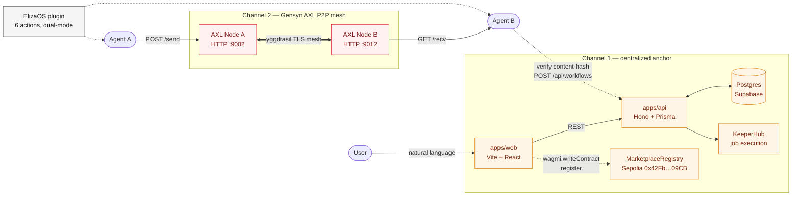

# Demo diagram — two channels

The loomlabs system runs over two parallel discovery channels:

- **Channel 1** — centralized anchor: `apps/web` → `apps/api` → Postgres,
  with the user signing a Sepolia `MarketplaceRegistry.register(...)`
  transaction from their own wallet.
- **Channel 2** — Gensyn AXL peer-to-peer mesh: an agent posts a workflow
  envelope to its local AXL node, the mesh routes it, and a second agent
  on a separate node receives + (optionally) deploys it through the same
  `apps/api`.

Use this single diagram in the architecture-brief section of the demo
video (3:15-3:45). Render it via <https://mermaid.live> and export PNG
or SVG.

## Diagram



## ElizaOS plugin actions reference

Use this table at the same time the diagram is on screen so judges can
match each action to its layer.

| Action | Mode | Purpose |
|--------|------|---------|
| `BROWSE_TEMPLATES` | dry-run | Local template registry read |
| `DESCRIBE_TEMPLATE` | dry-run | Single template + Sepolia metadata |
| `BROWSE_MARKETPLACE` | dry-run / live | Local fixtures, or `GET /api/marketplace` when configured |
| `CREATE_WORKFLOW` | dry-run / live | Local candidate, or full `POST /api/workflows` lifecycle |
| `CREATE_WORKFLOW_LIVE` | opt-in live | Sepolia transactions via host-injected signer/reader |
| `CHECK_AXL_NODE` | semi-live | `GET /topology` against the configured AXL node |
| `SEND_AXL_WORKFLOW_DRAFT` | semi-live | `POST /send` with envelope + `X-Destination-Peer-Id` |
| `RECEIVE_AXL_MESSAGES` | semi-live | `GET /recv`, parses envelope, returns from-peer id |
| `EXECUTE_RECEIVED_AXL_WORKFLOW` | semi-live | Receives, verifies content hash, deploys via Loom API |

(`CREATE_WORKFLOW_DEMO` is intentionally omitted — it duplicates the dry-run
path of `CREATE_WORKFLOW` for explicit demo namespaces.)

## Export tips

1. Open <https://mermaid.live>.
2. Paste the mermaid block (without the surrounding ``` fences) into the
   left pane.
3. Click **Actions → PNG** (white background) or **SVG**.
4. Place the image in the demo video at 3:15-3:45 — overlay the action
   table on the same screen for ~10 seconds.

If the mermaid editor renders the subgraphs side by side rather than
top-to-bottom, switch the top-level direction to `TB` (`flowchart TB` on
line 1) for a vertically stacked layout.
